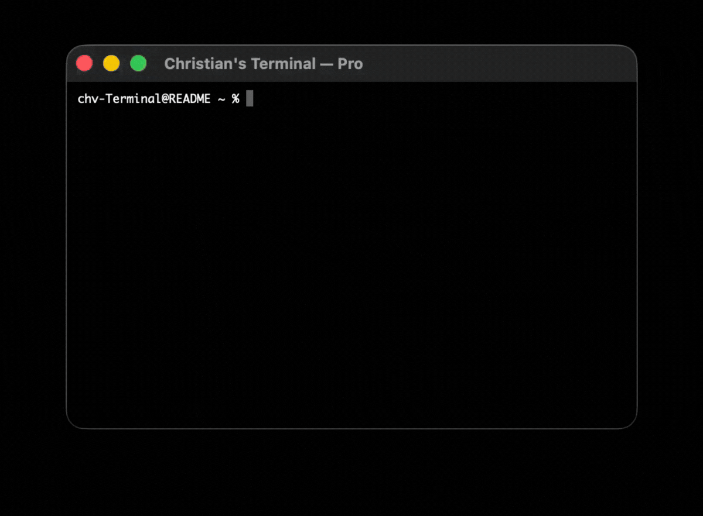
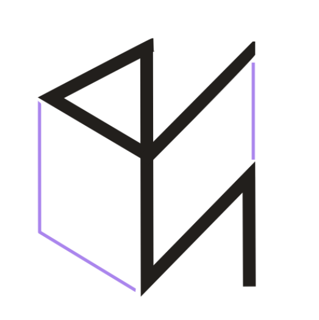

### whoami: **Christian Valenzuela**

👾 **Aspiring Cloud & DevOps Engineer • Creative Director**  
Building resilient, support-ready infrastructure and cohesive visual experiences.

  

 

 

---

#### 01 / about 

I bridge the gap between technical rigor and visual design. My focus is on reducing operational friction through automation while maintaining a creative eye for systems that are not just functional, but "support-ready."

#### 02 / Technical Toolbox

  <strong>Primary</strong> 
  
  
  
  
  
  
  

  <strong>Software Development</strong> 
  
  
  
  
  
  
  
  
  
   
  <strong>Content Creation</strong> 
  
  
  

 

 

---
#### 03 / little bit about me

<picture>
  <source media="(prefers-color-scheme: dark)" srcset="assets/terminal-dark.gif">
  <source media="(prefers-color-scheme: light)" srcset="assets/terminal-light.gif">
  
</picture>

  

 

  

  <picture>
    <source media="(prefers-color-scheme: dark)" srcset="assets/chv.logo-light.png">
    <source media="(prefers-color-scheme: light)" srcset="assets/chv.logo.png">
    
  </picture>

